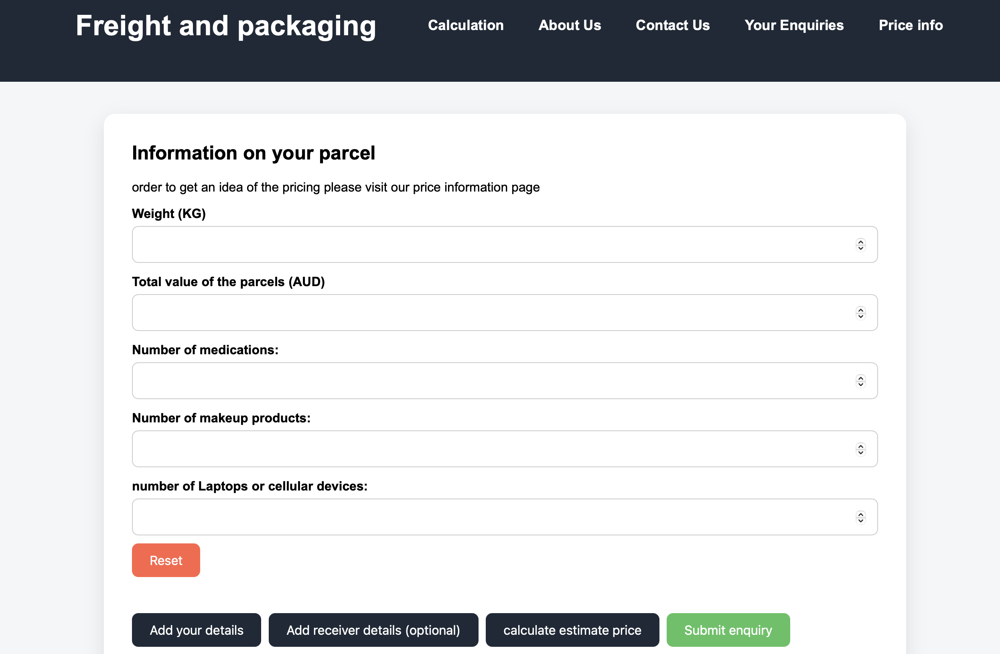
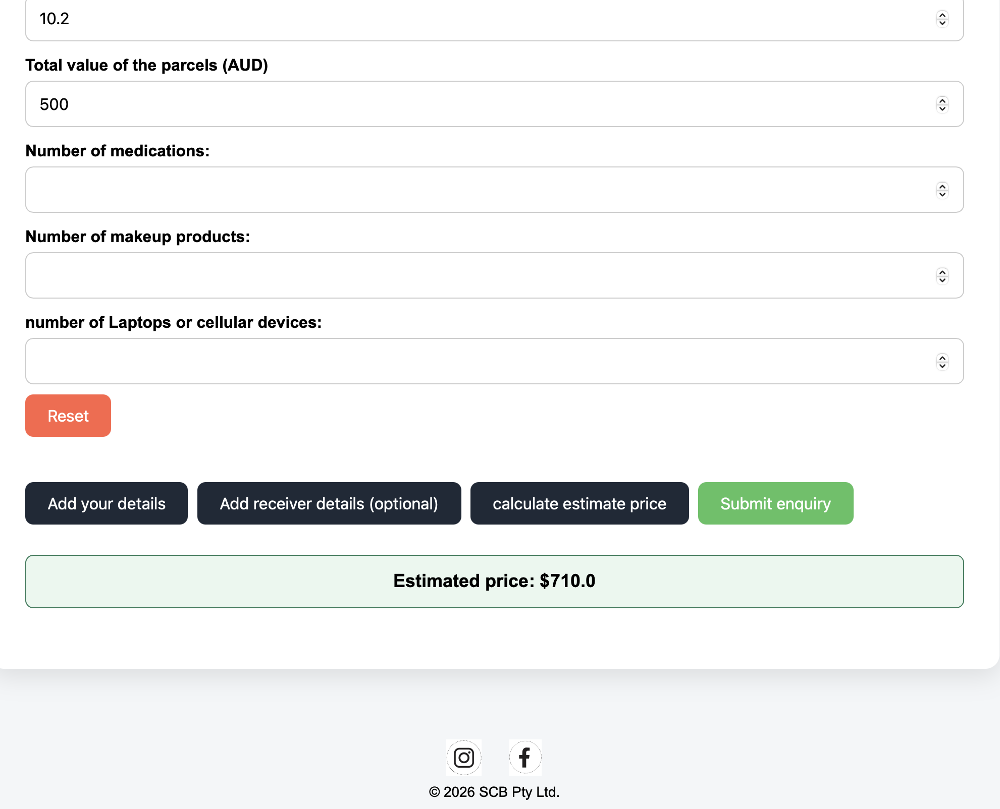
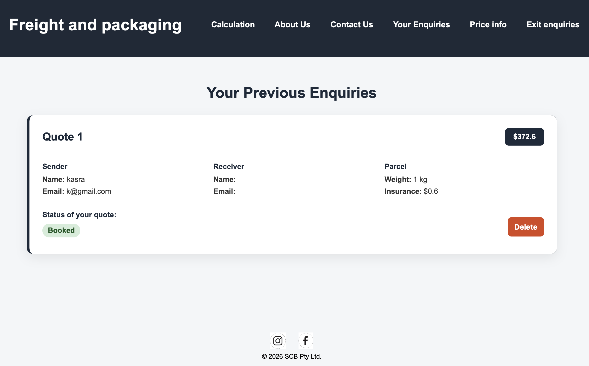
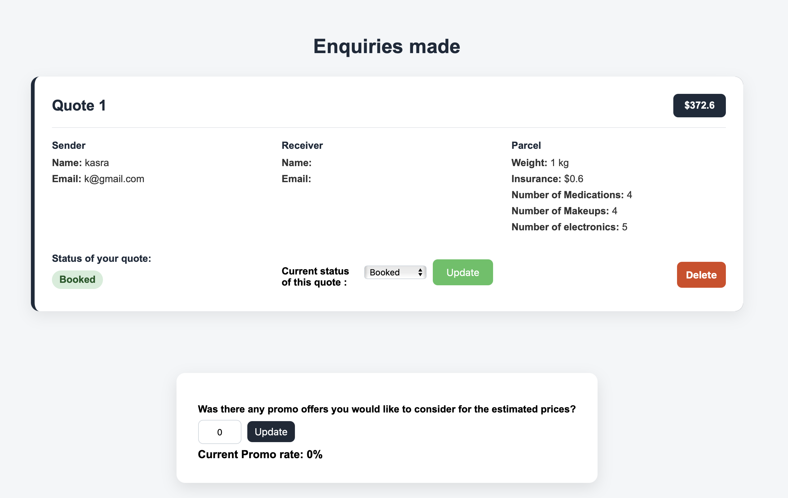
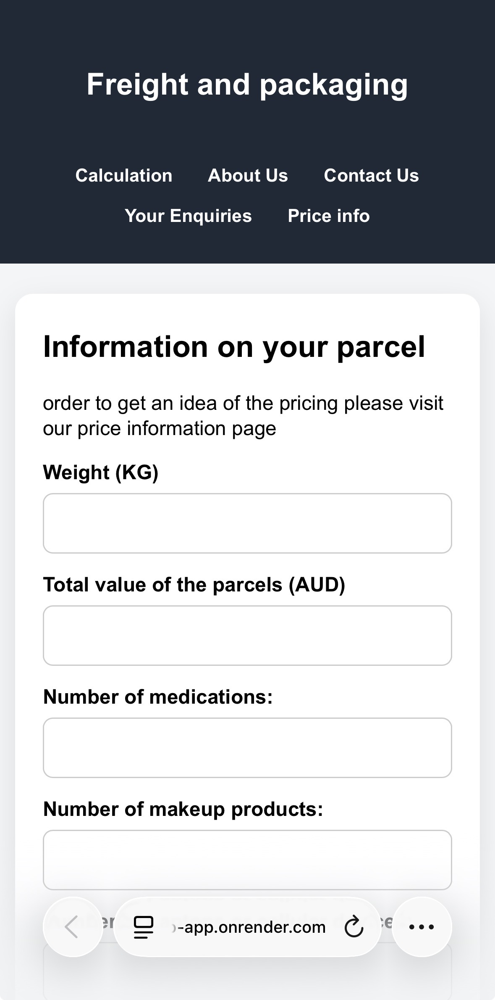

# Freight & Packaging Shipping Quote Web Application

A full-stack Flask web application developed for the Freight & Packaging service at Pack & Send Unley. The platform helps customers shipping parcels from Australia to Iran receive an estimated price without needing to request every quote by phone.

Customers can calculate an estimate, submit an enquiry and review previous enquiries using their email address. Administrators can manage enquiry statuses, delete enquiries and update promotional discount rates.

## Source Code

[View the GitHub repository](https://github.com/Kasra-Asarroodi/shipping-quote-web-app)

## Live Demonstration

The application has been publicly deployed using Render and can be accessed below.

https://shipping-quote-web-app.onrender.com

## Key Features

### Customer Features

- Calculate an estimated shipping price using parcel weight, dimensions and item information
- Submit a shipping enquiry
- Review previously submitted enquiries using the corresponding email address
- View the current status of each enquiry
- Access the website on desktop, tablet and mobile devices

### Administrator Features

- Securely access the administrator dashboard
- View all submitted enquiries
- Update enquiry statuses
- Delete enquiries
- Apply promotional discount rates to future quotations

## Technologies Used

### Backend

- Python
- Flask
- Gunicorn

### Frontend

- HTML
- CSS
- JavaScript

### Database

- SQLite

### Deployment and Version Control

- Render
- Git
- GitHub

## Project Structure

- app.py            — creates the Flask application
- app_routes.py     — contains the website routes
- calculation.py    — contains quotation calculation functions
- database.py       — manages SQLite database operations
- settings.py       — loads and updates promotional rate settings
- settings.json     — stores the current promotional discount rate
- enquiries.db      — stores customer enquiries
- templates/        — contains HTML templates
- static/           — contains CSS, JavaScript and images
- docs/             — contains project documentation

## Lessons Learned

This project helped me develop practical experience with:

- Flask web development
- SQLite databases
- Session-based administrator access
- Email-based enquiry retrieval
- Environment variables
- Git and GitHub
- Deploying applications with Render
- Debugging and modularising Python applications

## Screenshots

### Shipping Quote Form
#### The home page collects the information required to generate a shipping quotation or submit an enquiry. Customers enter parcel details such as weight, declared value and item quantities, while sender and receiver information can also be provided when submitting an enquiry.   

### Estimated quote results
#### Once the parcel information has been entered, the application instantly generates an estimate shipping quote using the predefined pricing rules. This allows the user to view and change their parcel's description before submitting their enquiry. 

### Customer enquiry Dashboard
#### Customers can view all enquiries associated with their email address, including parcel details, quotation values and the current processing status. This feature allows customers to monitor previous requests without needing to contact the business directly.

### Administrator Dashboard
#### The administrator dashboard centralises enquiry management, allowing staff to update shipment statuses, remove enquiries and manage promotional discount rates. These tools streamline administrative workflows and ensure customers receive up-to-date information.

### Responsive Mobile Layout
#### The application was designed with a responsive interface that automatically adapts to desktop, tablet and mobile devices, ensuring customers can access the quotation system from a wide range of screen sizes.

## Environment Variables

The application uses environment variables to securely store configuration values such as:

- SECRET_KEY
- ADMIN_PASSWORD
- DATABASE_PATH

These values are stored locally in a .env file and are excluded from the GitHub repository using .gitignore.

## Future Improvements

Future versions of the application may include:

- Customer accounts
- Email notifications
- PDF quotations
- Shipment tracking
- Improved administrator analytics
- Automatic shipping rate updates

## Project Status

Version 1.0 of the application has been completed and publicly deployed. The system remains under maintenance, with minor usability improvements and feature updates added when required.

**Initial development:** June 2026 – July 2026  
**Current status:** Deployed and maintained

